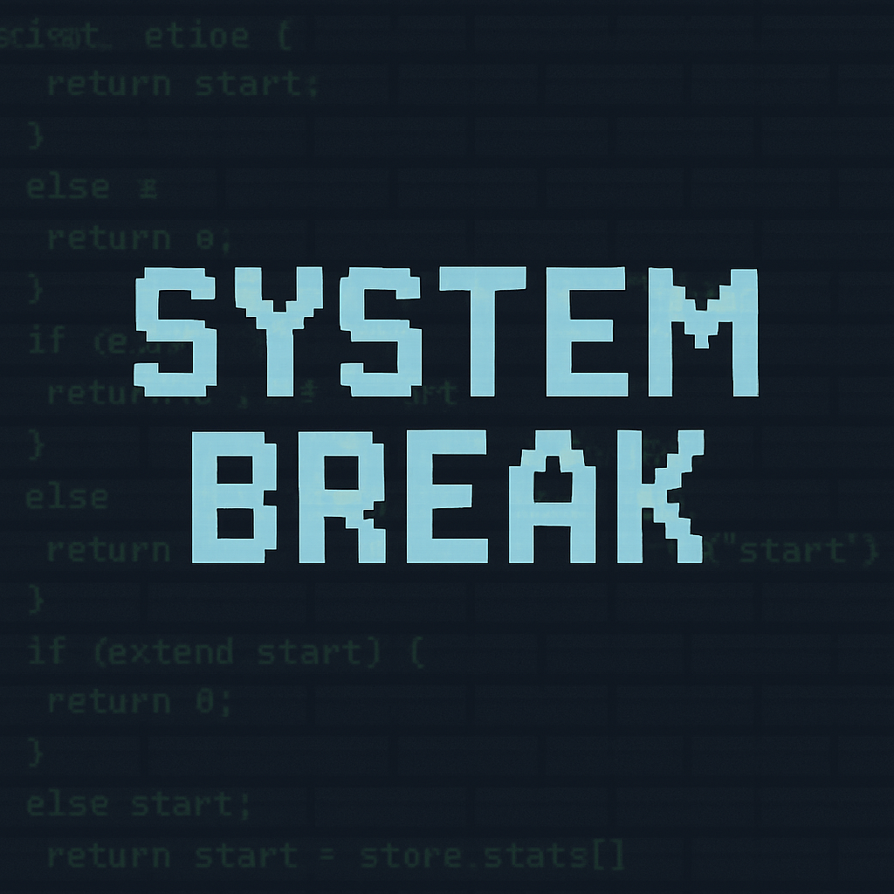

  

### PROJETO 3: Jogo em C (ainda sem título)

Projeto da disciplina de **Desenvolvimento de Algoritmos** no curso de **Ciências da Computação - 2° Ciclo** da universidade _FEI_.

## Desenvolvedores: 

Desenvolvido por: 
Kaique Medeiros Moreira: 22.224.005-3
& 
Thayane de Sousa Andrade: 22.224.003-8

## Proposta:

Desenvolver por meio da linguagem de programação C, um jogo 100% interativo por linhas de comando com temática livre, contendo as funcionalidades de saida, reinicio, salvamento e carregamento de save files, além de um registro "log.txt" com as ações do jogador. 

### Informações Sobre o Jogo:

* Gênero: RPG
* Tema: Hacker, Suspense.
* Objetivo: Vencer os desafios do hacker para se livrar da ameaça
* Condição de derrota: Falhar 3 vezes nos desafios

## Como jogar:

Toda a jogatina é feita por meio de entradas de texto no terminal, as escolhas são mostradas ao jogador e o mesmo digita a decisão que deseja tomar.

## Detalhes da gameplay: 

O jogo se inicia com um jogo de "fachada" sobre adivinhação de números, no fim do mesmo, o hacker "anon1mo333" se apresenta em uma sequência cinemática e da início ao jogo de verdade. A jogatina inteira possui muita interatividade e um foco na imersão do jogador, com funções de "delay" que atrasam o funcionamento do código propositalmente de forma a proporcionar uma experiência mais realista como no caso da digitação demorada do hacker, simulando uma ação humana. Todos os desafios ou "puzzles" são voltados para a temática de programação e computação num geral, tornando a experiência mais familiar com o projeto e o curso como um todo.

PS: arquivo de LOG e de SAVE é criado durante a execução do código.

### Progresso: 

 📍 🟩🟩🟩🟩🟩🟩🟩🟩🟩🟩 🏁 
