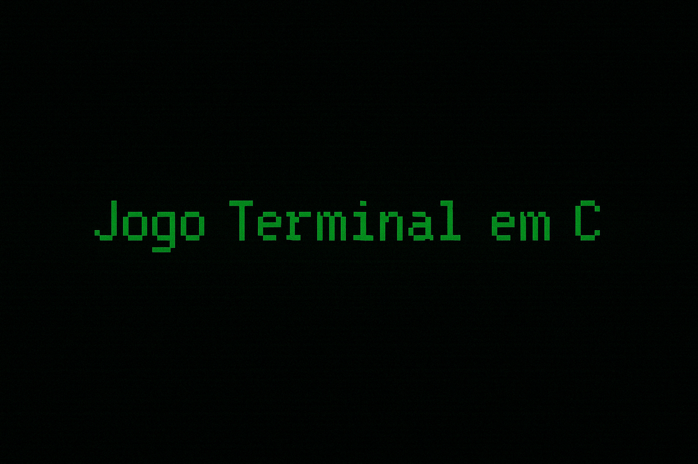

  

### PROJETO 3: Jogo em C (ainda sem título)

Projeto da disciplina de **Desenvolvimento de Algoritmos** no curso de **Ciências da Computação - 2° Ciclo** da universidade _FEI_.

## Desenvolvedores: 

Desenvolvido por: Kaique Medeiros Moreira & Thayane de Sousa Andrade

## Proposta:

Desenvolver por meio da linguagem de programação C, um jogo 100% interativo por linhas de comando com temática livre, contendo as funcionalidades de saida, reinicio, salvamento e carregamento de save files, além de um registro "log.txt" com as ações do jogador. 

### Informações Sobre o Jogo:

* Gênero: RPG
* Tema: _A DEFINIR_
* Objetivo: _A DEFINIR_
* Condição de derrota: _A DEFINIR_

## Como jogar:

Toda a jogatina é feita por meio de entradas de texto no terminal, as escolhas são mostradas ao jogador e o mesmo digita a decisão que deseja tomar.

## Detalhes da gameplay: 

_A DEFINIR_

### Progresso: 

 📍 🟩🟥🟥🟥🟥🟥🟥🟥🟥🟥 🏁 